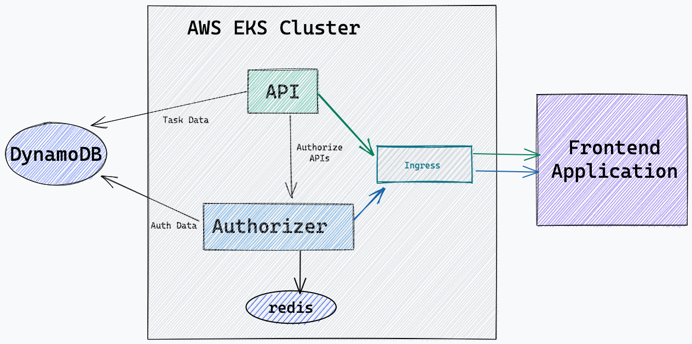

# Authorizer + DynamoDB Demo

This repository contains demo code for task manager application built using Authorizer, DynamoDB, Golang and React. It also walks you through EKS deployment



## Getting Started

### Prerequisite

- [aws account](https://aws.amazon.com/)
- [iam](https://aws.amazon.com/iam/) user with permission for DynamoDB, EKS, EC2, IAM Policy Creation, Route53, EBS Controller
- [kubectl](https://kubernetes.io/docs/tasks/tools/)
- [awscli](https://aws.amazon.com/cli/)
- [eksctl](https://eksctl.io/)
- [helm](https://helm.sh/)
- Configure AWS profile on your machine with user credentials
- Export your AWS credentials
  ```sh
  aws configure --profile PROFILE_NAME
  export AWS_PROFILE=PROFILE_NAME
  export AWS_ACCESS_KEY_ID=YOUR_ACCESS_KEY_ID
  export AWS_SECRET_ACCESS_KEY=YOUR_SECRET_ACCESS_KEY
  ```

### Step 1: Create EKS Cluster

> Note: You can update machine configuration in eks.yaml file.

```sh
eksctl create cluster -f eks.yaml
```

### Step 2: Install Nginx Ingress

```sh
helm repo add ingress-nginx https://kubernetes.github.io/ingress-nginx

helm repo update

helm upgrade --install ingress-nginx ingress-nginx/ingress-nginx \
 --namespace ingress-nginx \
 --create-namespace \
 --timeout 600s \
 --debug \
 --set controller.publishService.enabled=true
```

### Step 3: Install Cert Manager

Cert manager is used to generate TLS certificate

```sh
helm repo add jetstack https://charts.jetstack.io

helm repo update

kubectl apply -f https://github.com/cert-manager/cert-manager/releases/download/v1.8.2/cert-manager.crds.yaml

helm install \
 cert-manager jetstack/cert-manager \
 --namespace cert-manager \
 --create-namespace \
 --version v1.8.2
```

### Step 4: Install Authorizer

> Note: Please change `authorizer.authorizer_url` as per your domain and URL.

```sh
helm repo add authorizer https://helm-charts.authorizer.dev

helm repo update

helm install \
 --set authorizer.database_type=dynamodb \
 --set authorizer.aws_access_key_id=${AWS_ACCESS_KEY_ID} \
 --set authorizer.aws_secret_access_key=${AWS_SECRET_ACCESS_KEY} \
 --set authorizer.aws_region=us-east-1 \
 --set authorizer.authorizer_url=https://auth.aws-demo.authorizer.dev \
 --set redis.install=true \
 --set redis.storage=5Gi \
 --set redis.storageClassName=gp2 \
 --set securityContext.readOnlyRootFilesystem=false \
authorizer authorizer/authorizer
```

### Step 5: Create Route53 Hosted Zone

- Create Hosted Zone
- Create Subdomain Record with classic load balancer and select loadbalancer created by nginx

Example: `auth.aws-demo.authorizer.dev` in below screenshot


### Step 6: Create Cluster Issuer with dns01 challenge

> Note: Change email & hostzoneID as per step5 in `cluster_issuer.yaml`

Cert manager will add txt record and will verify the domain details using this issuer.

```sh
kubectl apply -f cluster_issuer.yaml
```

### Step 7: Create Ingress for authorizer

> Note: Change authorizer domain as per your auth domain in `authorizer_ingress.yaml`

```sh
kubectl apply -f authorizer_ingress.yaml
```

Open your authorizer dashboard, configure admin password and get client ID.

### Step 8: Deploy API resources

> Note: Change `authorizer_client_id` to based64 encoded value authorizer client_id value obtained in step 7 in api.yaml L:8. Also change domain name in ingress section.

```sh
kubectl apply -f api.yaml
```

### Step 9: Deploy frontend

You can deploy frontend to provider of your choice OR on the same stack. For demo purpose I have deployed it on Netlify and connected subdomain there.

## URLs

- Application URL: https://aws-todo-demo.authorizer.dev/
- Authorizer URL: https://auth.aws-demo.authorizer.dev
- API URL: https://api.aws-demo.authorizer.dev
